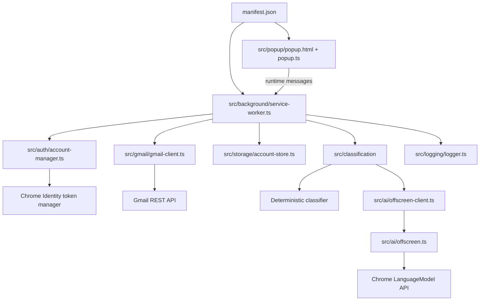

# LabelPilot current codebase context

Last reviewed: 2026-09-13. For progress and verification status, see [README_REDESIGN.md](README_REDESIGN.md). This document describes what exists in the repository now, not a claim that every feature is production-ready.

## Product and runtime

LabelPilot is a client-only Manifest V3 Chrome extension that reads Gmail message metadata, classifies messages against existing user labels, and can apply a label when the user has enabled automation. It uses deterministic scoring first and Chrome's Prompt API as an optional fallback. No backend or full email-body retrieval is implemented.

## Build and entry points

- `manifest.json` is the source manifest. Vite copies it to `dist/manifest.json`.
- `src/background/service-worker.ts` handles alarms, runtime messages, scans, classification orchestration, and label application. Scan coordination remains in this file rather than a separate scanning module.
- `src/popup/popup.html` and `src/popup/popup.ts` provide account, preview, automation, label-refresh, AI-initialization, and basic activity controls.
- `src/ai/offscreen.html` and `src/ai/offscreen.ts` host AI requests.
- `npm run build` emits the unpacked extension in `dist/`.

## Account and storage model

`src/storage/schema.ts` defines `AppState` version 2. `src/storage/account-store.ts` persists it under `labelpilot.v2`. Each account context contains labels, sender-domain mappings, pagination, settings, and link/sync timestamps. Activity is stored separately with a key scoped to the account and bounded to 500 events.

`src/auth/account-manager.ts` links an account using interactive Chrome Identity, obtains its Gmail profile, and uses the profile email as the local account key. Switching requests a token and checks the returned Gmail profile against the stored email before making that account active. `TokenManager` caches tokens in service-worker memory only. **The multi-account token-selection lifecycle is not yet proven across worker restarts or multiple signed-in Google accounts; treat account switching as partial until manually verified.**

The `labelpilot.v2` namespace intentionally does not migrate old flat prototype keys. Unlinking removes one account's context and activity. A reset-all storage message exists, but the popup currently lacks a reset-all control.

## Gmail and scan flow

`src/gmail/gmail-client.ts` provides typed profile, label, message-list, metadata, and modify operations. It normalizes HTTP failures and retries network/server/rate-limit failures up to three times. `src/gmail/gmail-parser.ts` converts Gmail data into `EmailMetadata` and filters system labels. Scans use `in:inbox`, request metadata only, skip already user-labeled messages, and optionally exclude non-primary categories.

The service worker implements a single in-memory scan promise. It checks the active account, honors the automation setting for alarm scans, and supports preview and automatic modes. Preview mode does not call the Gmail modify endpoint; it writes proposed label IDs into activity metadata. The popup does not yet render a readable proposal review list. Pagination is persisted per account, but boundary behavior does not yet have tests and must be verified before relying on long inbox scans.

Potential race: account switch/unlink does not cancel or wait for a running scan. Scan work uses an account snapshot and may continue against that account until its request sequence finishes. Add explicit account-aware cancellation/locking before release.

## Classification

`src/classification/deterministic-classifier.ts` uses subject, sender name/domain, snippet overlap, historical domain mapping, and optional thread label ID. The current scan does not supply a thread label ID. It returns a label only when the top candidate reaches the configured threshold and is not tied with the runner-up; otherwise it returns a skip result with a reason.

`src/classification/ai-classifier.ts` invokes AI only after deterministic classification skips. `src/ai/offscreen.ts` checks model availability and accepts only an exact existing label ID (or `NONE`). Email metadata is treated as untrusted prompt data. AI output is not currently constrained with Prompt API `responseConstraint`; safety relies on the prompt plus exact ID validation. Chrome Prompt API compatibility, initialization/download states, timeout behavior, and production extension access need manual verification.

## Logging and UI

`src/logging/logger.ts` emits structured console events and stores bounded per-account events. Metadata keys suggesting tokens, bodies, snippets, or content are removed. Current activity UI shows only a basic time/step/outcome/message-ID list. Filtering, complete proposal detail, diagnostic export, and automated redaction tests remain outstanding.

## Configuration and tools

- `src/config.ts`: Gmail API base, query, alarm cadence, limits, scores, excluded domains, storage key, and AI language options.
- `package.json`: build, typecheck, test, lint, and format scripts.
- `tests/`: current unit tests for text utilities, parser behavior, deterministic decisions, and storage schema isolation.
- The current suite is small: 7 tests. There are no Chrome API mocks, live Gmail tests, account lifecycle tests, scan/pagination tests, or AI protocol tests yet.

## Current validation

Last local validation: `npm test`, `npm run lint`, `npm run typecheck`, and `npm run build` passed. This does not validate OAuth account switching, real Gmail calls, Chrome AI availability, or the popup/offscreen runtime. See the manual checklist in [README_REDESIGN.md](README_REDESIGN.md).
